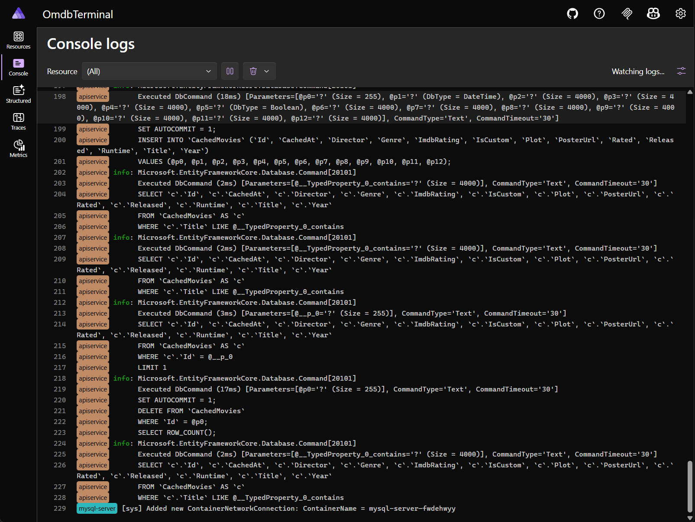
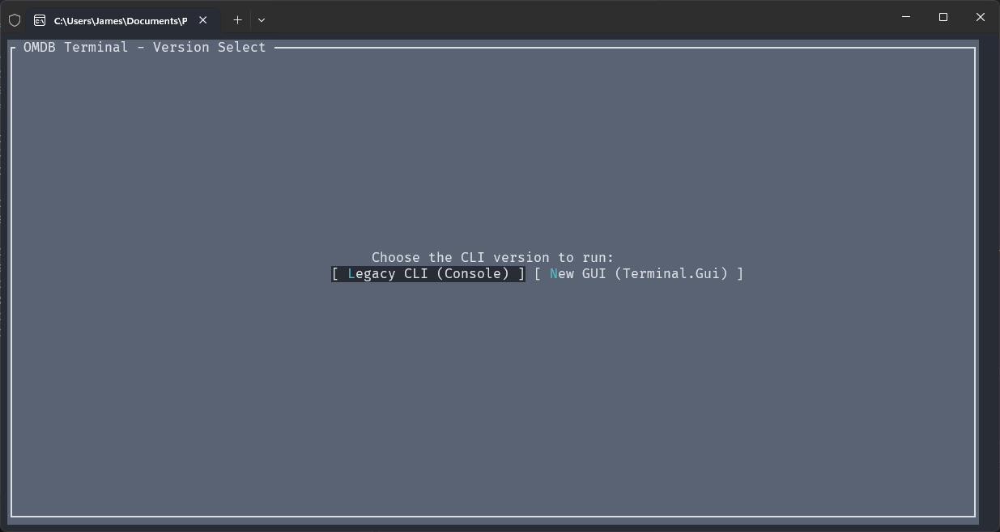
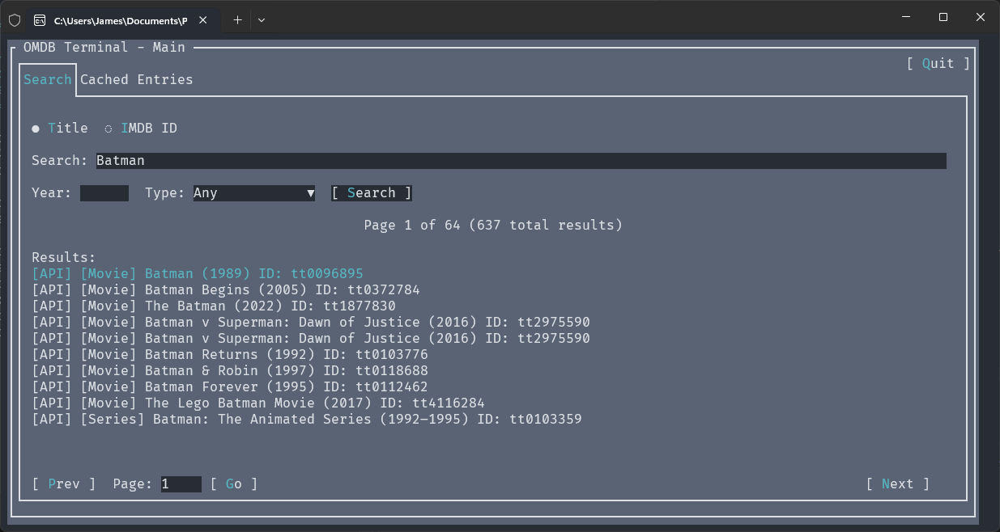
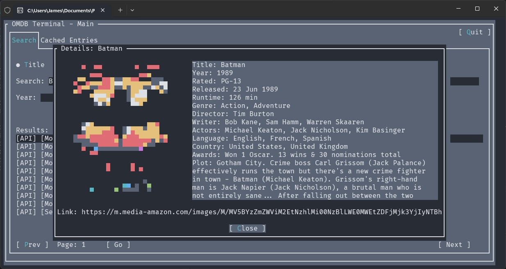
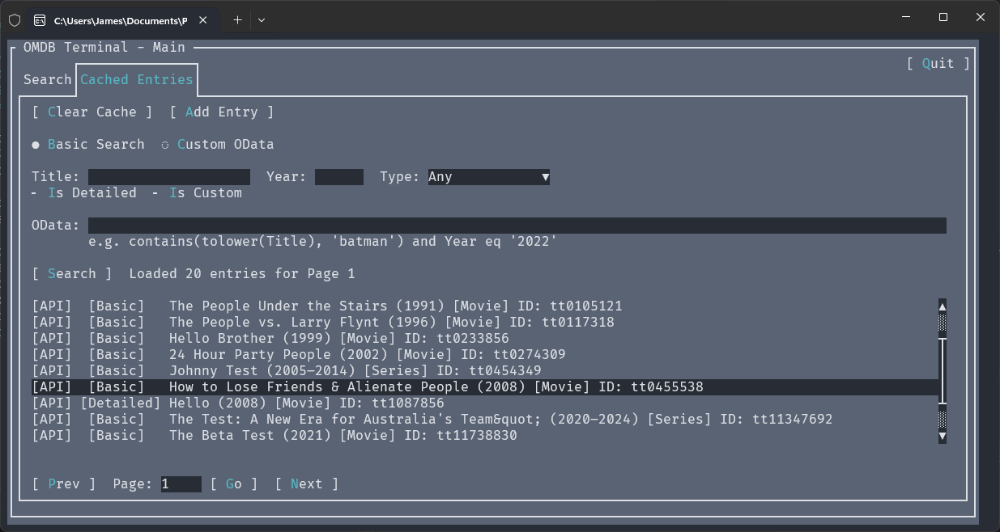
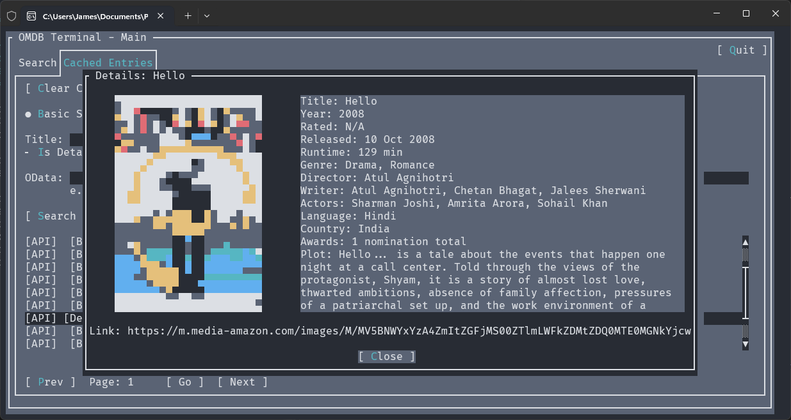
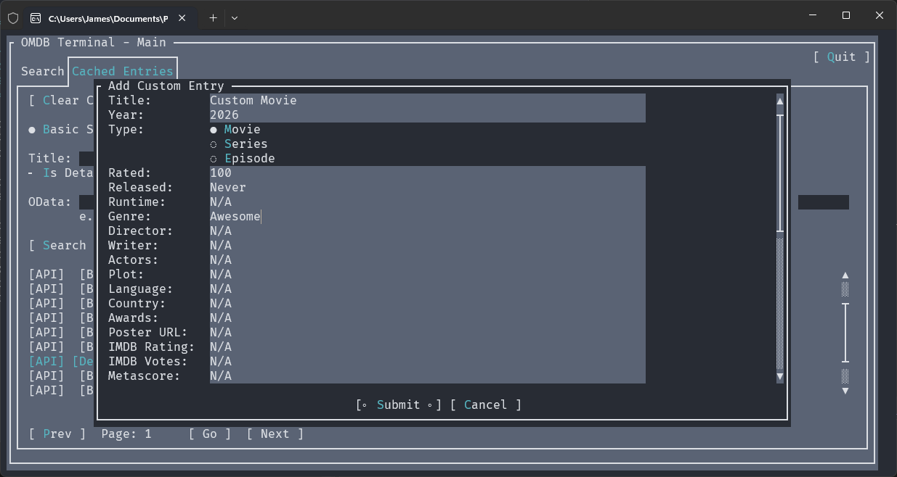
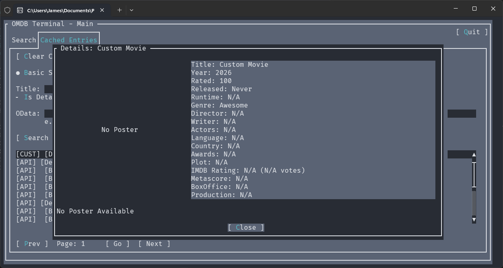
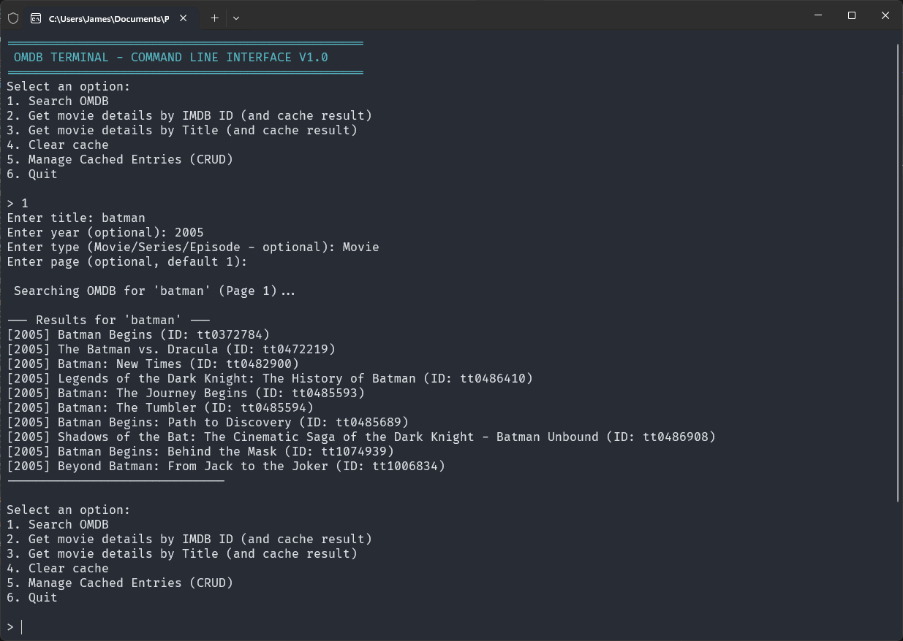

# OMDB Terminal

<div align="center">


</div>

<div align="center">

[](https://github.com/JAllsop/Omdb-Terminal-CarTrack-JAllsop/actions/workflows/release.yaml)
[](https://github.com/JAllsop/Omdb-Terminal-CarTrack-JAllsop/issues)
[](https://github.com/JAllsop/Omdb-Terminal-CarTrack-JAllsop/pulls)

</div>

OMDB Terminal is a .NET-based CLI application and REST API designed to interact with the [Open Movie Database (OMDb) API](https://www.omdbapi.com/). Built with a focus on modern .NET architecture (.NET 10), performance, and developer experience. It serves as a proxy for movie data, has intelligent caching and OData search capabilities

The project is orchestrated using .NET Aspire, which handles containerization, telemetry, and infrastructure management, enabling feature implementation and easy setup

## Table of Contents

- [Features](#features)
   - [Core Capabilities](#core-capabilities)
   - [Architecture \& Infrastructure](#architecture--infrastructure)
      - [Database Schema](#database-schema)
   - [Developer Experience](#developer-experience)
- [Media Showcase](#media-showcase)
   - [.NET Aspire Infrastructure](#net-aspire-infrastructure)
   - [Terminal CLI (V2)](#terminal-cli-v2)
   - [V2 Demo Video](#v2-demo-video)
   - [Terminal CLI (V1.1)](#terminal-cli-v11)
   - [V1.1 Demo Video](#v11-demo-video)
- [Technical Considerations \& Known Limitations](#technical-considerations--known-limitations)
- [Getting Started](#getting-started)
   - [Prerequisites](#prerequisites)
   - [Running the Project](#running-the-project)
   - [1. Clone the Repository](#1-clone-the-repository)
   - [2. Start the Backend Infrastructure](#2-start-the-backend-infrastructure)
   - [3. Run the CLI](#3-run-the-cli)
   - [Pre-Compiled CLI Binaries](#pre-compiled-cli-binaries)


## Features

### Core Capabilities

- **OMDb API Integration:** Search for movies by title or fetch detailed information using an IMDb ID
- **Intelligent Caching (Cache-Aside Pattern):** Movie details fetched from OMDb are automatically persisted to a local MySQL database. Subsequent requests for the same movie are served from the database - reducing API quota usage and improving response times
- **Advanced Data Searching (OData):** Perform complex, server-side filtering, sorting, and pagination on cached movie data directly via standard OData query strings (e.g., `?$filter=contains(Title, 'Matrix')&$orderby=Year desc`)
- **Complete Cache Management:** Full CRUD (Create, Read, Update, Delete) operations available via a dedicated `CachedEntries` controller

### Architecture & Infrastructure

<div align="center">
  
</div>

- **Frontend (Terminal CLI):** A standalone .NET console application - interacts with users and communicates with the backend via HTTP/OData
- **Backend (REST API):** A ASP.NET Core API providing endpoints for searching, fetching, and managing OMDB movie data
- **.NET Aspire Orchestration:** The entire solution (API, MySQL Database, and Telemetry) is managed by .NET Aspire, ensuring a one-click local setup with automatic container provisioning and connection string injection
- **Entity Framework Core:** Leverages [EF Core](https://www.nuget.org/packages/microsoft.entityframeworkcore) with [Pomelo MySQL](https://www.nuget.org/packages/Pomelo.EntityFrameworkCore.MySql/) for automated design-time migrations and data operations
- **Service-Oriented Architecture:** Strict separation of concerns, keeping Controllers thin by delegating business logic and database interactions to dedicated services (`IMovieService`, `ICachedEntriesService`)
- **Dependency Injection:** Utilizes a static `SimpleInjector` container within the CLI for dependency resolution

#### Database Schema

The database relies on Entity Framework Core to manage relations between cached movies and their associated ratings

<div align="center">
  
</div>

- **MovieEntity:** Stores comprehensive movie metadata (Title, Year, Plot, Poster, etc.) and tracks cache status (`IsDetailed`, `IsCustom`)
- **RatingsEntity:** Relies on a one-to-many relationship linking a movie to various rating sources (e.g., Internet Movie Database, Rotten Tomatoes, Metacritic)

### Developer Experience

- **Swagger Integration:** Full OpenAPI documentation with a custom Swagger filter (`ODataOperationFilter`) to natively support OData parameter inputs within the Swagger UI
- **OpenTelemetry Dashboard:** Real-time visibility into database queries, HTTP requests, and application logs via the .NET Aspire Dashboard

## Media Showcase

### .NET Aspire Infrastructure

<table width="100%">
  <tr>
    <td width="50%" align="center"><em>.NET Aspire Dashboard</em></td>
    <td width="50%" align="center"><em>.NET Aspire Startup Logs</em></td>
  </tr>
  <tr>
    <td></td>
    <td></td>
  </tr>
</table>

### Terminal CLI (V2)

<table width="100%">
  <tr>
    <td width="50%" align="center"><em>CLI Startup</em></td>
    <td width="50%" align="center"><em>Searching for Movies by Title</em></td>
  </tr>
  <tr>
    <td></td>
    <td></td>
  </tr>
  <tr>
    <td align="center"><em>Opening a Searched Movie</em></td>
    <td align="center"><em>Viewing Cached Entries</em></td>
  </tr>
  <tr>
    <td></td>
    <td></td>
  </tr>
  <tr>
    <td align="center"><em>Opening a Cached Entry</em></td>
    <td align="center"><em>Custom Cache Query</em></td>
  </tr>
  <tr>
    <td></td>
    <td></td>
  </tr>
  <tr>
    <td align="center"><em>Custom Entry View</em></td>
  </tr>
  <tr>
    <td></td>
  </tr>
</table>

### V2 Demo Video

https://github.com/user-attachments/assets/52e00f92-4835-451e-9eb7-a4e2a3364787

### Terminal CLI (V1.1)

<table width="100%">
  <tr>
    <td width="50%" align="center"><em>Searching for movies by title</em></td>
    <td width="50%" align="center"><em>Fetching and caching detailed movie data by IMDb ID</em></td>
  </tr>
  <tr>
    <td></td>
    <td></td>
  </tr>
</table>

### V1.1 Demo Video

https://github.com/user-attachments/assets/1d861ac8-a691-4f4d-91fa-9ea94d7da871

## Technical Considerations & Known Limitations

As this project is designed primarily as a technical assessment, several intentional trade-offs were made to prioritize ease-of-use and rapid deployment:

- **CLI/API Coupling:** V1.1 featured tight UI/API coupling to establish a rapid MVP - V2 fully resolves this with a cleaner separation of concerns
- **Automated Migrations:** Entity Framework migrations run automatically on startup for ease of local testing - in production, these would be managed via secure, on-demand scripts to prevent data loss (among other issues)
- **In-Repo API Key:** A demo OMDb API key is deliberately included in the repository for a frictionless review process - exposing it here is safe as it exclusively accesses a free, read-only service

## Getting Started

### Prerequisites

- [.NET 10 SDK](https://dotnet.microsoft.com/download)
- [Docker Desktop](https://www.docker.com/products/docker-desktop/) (required for .NET Aspire to spin up MySQL)
- Git

> *Note: For ease of testing and review, this repository is pre-configured with a demo OMDb API key — you do not need to generate or configure your own to run the project. **In a Real World Environment, this would not be the case!***

### Running the Project

> **Architecture Note:** <br/>
.NET Aspire is a cloud-native orchestrator - it is designed to be deployed to cloud environments not run as a standalon desktop app <br/>
Because of this, **you cannot simply run the standalone CLI executable without first spinning up the backend locally** <br/>
The .NET SDK handles automatically provisioning the MySQL Docker containers and injecting the dynamic connection strings into the API proxy

#### 1. Clone the Repository

Open your terminal and clone the repository to your local machine:

```bash
git clone https://github.com/JAllsop/Omdb-Terminal-CarTrack-JAllsop.git
cd Omdb-Terminal-CarTrack-JAllsop
```

#### 2. Start the Backend Infrastructure

Open a terminal in the root of the repository and run the setup script for your operating system

- **Windows**
  ``` Powershell
  .\start-backend-windows.ps1
  ```

- **Mac/Linux**
  ``` bash
  .\start-backend-windows.ps1
  ```

The scripts do the following:

- Check for and initalise .NET User Secrets
- Save the API key to .NET User Secrets - the included or user provided one
- Spin up the Aspire orchestrator (API & MySQL Database)

#### 3. Run the CLI

Leave the backend terminal running. Open a new terminal window, navigate to the CLI project, and run it:
``` Bash
cd OmdbTerminal/OmdbTerminal.Cli
dotnet run
```

#### Pre-Compiled CLI Binaries

If you prefer not to compile the frontend yourself using dotnet run, you can download the standalone CLI executable (available for Windows, macOS, and Linux) directly from the Releases tab

>**Important:** You must still complete steps 1 & 2 above to run the Aspire backend infrastructure locally so the pre-compiled CLI has an API to connect to
