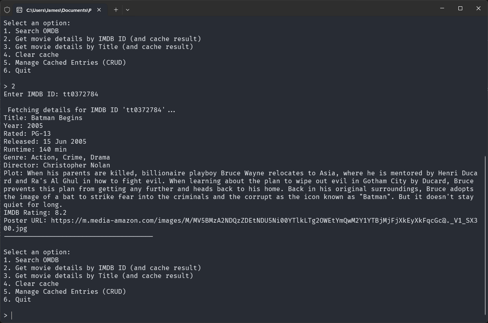
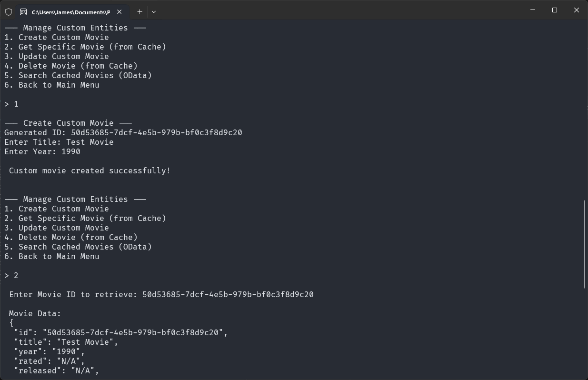

# OMDB Terminal

<div align="center">


</div>

<div align="center">

   [](https://github.com/JAllsop/Omdb-Terminal-CarTrack-JAllsop/actions/workflows/release.yaml)

</div>

OMDB Terminal is a .NET-based CLI application and REST API designed to interact with the [Open Movie Database (OMDb) API](https://www.omdbapi.com/). Built with a focus on modern .NET architecture (.NET 10), performance, and developer experience. It serves as a proxy for movie data, has intelligent caching and OData search capabilities

The project is orchestrated using .NET Aspire, which handles containerization, telemetry, and infrastructure management, allowing developers to focus on building features without worrying about setup or configuration

## Table of Contents

- [Features](#features)
   - [Core Capabilities](#core-capabilities)
   - [Architecture \& Infrastructure](#architecture--infrastructure)
   - [Developer Experience](#developer-experience)
- [Media Showcase](#media-showcase)
   - [Terminal CLI](#terminal-cli)
   - [.NET Aspire Infrastructure](#net-aspire-infrastructure)
   - [Demo Video](#demo-video)
- [Planned Improvements (V2)](#planned-improvements-v2)
- [Getting Started](#getting-started)
   - [Prerequisites](#prerequisites)
   - [Running the Project](#running-the-project)
   - [1. Clone the Repository](#1-clone-the-repository)
   - [2. Start the Backend Infrastructure](#2-start-the-backend-infrastructure)
   - [3. Run the CLI](#3-run-the-cli)
   - [Pre-Compiled CLI Binaries](#pre-compiled-cli-binaries)


## Features

### Core Capabilities

- **OMDb API Integration:** Search for movies by title or fetch detailed information using an IMDb ID
- **Intelligent Caching (Cache-Aside Pattern):** Movie details fetched from OMDb are automatically persisted to a local MySQL database. Subsequent requests for the same movie are served from the database - reducing API quota usage and improving response times
- **Advanced Data Searching (OData):** Perform complex, server-side filtering, sorting, and pagination on cached movie data directly via standard OData query strings (e.g., `?$filter=contains(Title, 'Matrix')&$orderby=Year desc`)
- **Complete Cache Management:** Full CRUD (Create, Read, Update, Delete) operations available via a dedicated `CachedEntries` controller

### Architecture & Infrastructure

- **.NET Aspire Orchestration:** The entire solution (API, MySQL Database, and Telemetry) is managed by .NET Aspire, ensuring a one-click local setup with automatic container provisioning and connection string injection
- **Entity Framework Core:** Leverages [EF Core](https://www.nuget.org/packages/microsoft.entityframeworkcore) with [Pomelo MySQL](https://www.nuget.org/packages/Pomelo.EntityFrameworkCore.MySql/) for automated design-time migrations and data operations
- **Service-Oriented Architecture:** Strict separation of concerns, keeping Controllers thin by delegating business logic and database interactions to dedicated services (`IMovieService`, `ICachedEntriesService`)
- **Dependency Injection:** Utilizes a static `SimpleInjector` container within the CLI for dependency resolution

### Developer Experience

- **Swagger Integration:** Full OpenAPI documentation with a custom Swagger filter (`ODataOperationFilter`) to natively support OData parameter inputs within the Swagger UI
- **OpenTelemetry Dashboard:** Real-time visibility into database queries, HTTP requests, and application logs via the .NET Aspire Dashboard

## Media Showcase

### Terminal CLI

*Searching for movies by title*


*Fetching and caching detailed movie data by IMDb ID*


*Manually creating a cached entry via the CLI*



### .NET Aspire Infrastructure

*The .NET Aspire Dashboard showing live telemetry, traces, and connected resources*


*Startup logs demonstrating automatic MySQL container provisioning and EF Core migration execution*


### Demo Video

https://github.com/user-attachments/assets/53edacd8-fb5f-4208-97d6-a5a10ba4d57e

## Planned Improvements (V2)

While V1.1 establishes a rock-solid backend foundation and MVP loop, V2 will focus on significantly enhancing the user interface and expanding the application's intelligence.

- **Graphical Terminal UI:** Transition from a basic `while` loop to a proper GUI using `Terminal.Gui` (gui.cs), featuring interactive lists, input fields, and dialog boxes
- **Improved Logging:** More granular and structured logging via OpenTelemetry for deeper insights into cache hit/miss ratios and pipeline execution
- **Improved Error Handling:** Implement more robust error handling and user feedback in the CLI, especially around API failures, database issues, and invalid inputs

## Getting Started

### Prerequisites

- [.NET 10 SDK](https://dotnet.microsoft.com/download)
- [Docker Desktop](https://www.docker.com/products/docker-desktop/) (required for .NET Aspire to spin up MySQL)
- Git

> *Note: For ease of testing and review, this repository is pre-configured with a demo OMDb API key — you do not need to generate or configure your own to run the project. **In a Real World Environment, this would not be the case!***

### Running the Project

> **Architecture Note:** <br/>
.NET Aspire is a cloud-native orchestrator - it is designed to be deployed to cloud environments not run as a standalon desktop app <br/>
Because of this, **you cannot simply run the standalone CLI executable without first spinning up the backend locally** <br/>
The .NET SDK handles automatically provisioning the MySQL Docker containers and injecting the dynamic connection strings into the API proxy

#### 1. Clone the Repository

Open your terminal and clone the repository to your local machine:

```bash
git clone https://github.com/JAllsop/Omdb-Terminal-CarTrack-JAllsop.git
cd Omdb-Terminal-CarTrack-JAllsop
```

#### 2. Start the Backend Infrastructure

Open a terminal in the root of the repository and run the setup script for your operating system

- **Windows**
  ``` Powershell
  .\start-backend-windows.ps1
  ```

- **Mac/Linux**
  ``` bash
  .\start-backend-windows.ps1
  ```

The scripts do the following:

- Check for and initalise .NET User Secrets
- Save the API key to .NET User Secrets - the included or user provided one
- Spin up the Aspire orchestrator (API & MySQL Database)

#### 3. Run the CLI

Leave the backend terminal running. Open a new terminal window, navigate to the CLI project, and run it:
``` Bash
cd OmdbTerminal/OmdbTerminal.Cli
dotnet run
```

#### Pre-Compiled CLI Binaries

If you prefer not to compile the frontend yourself using dotnet run, you can download the standalone CLI executable (available for Windows, macOS, and Linux) directly from the Releases tab

>**Important:** You must still complete steps 1 & 2 above to run the Aspire backend infrastructure locally so the pre-compiled CLI has an API to connect to