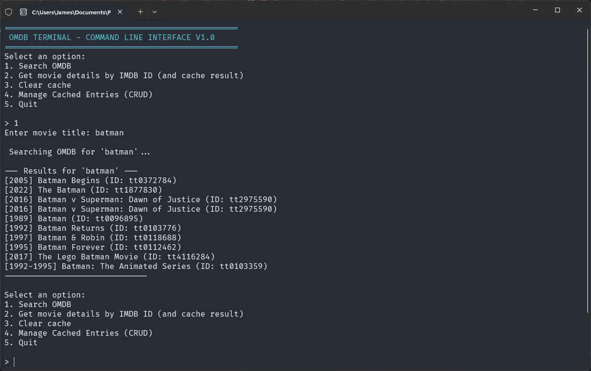
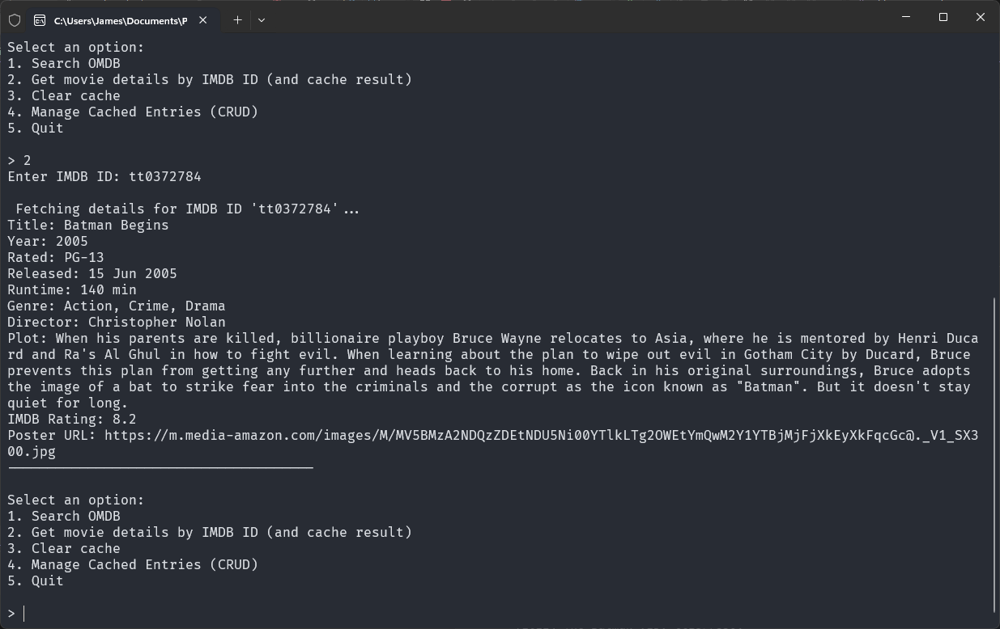
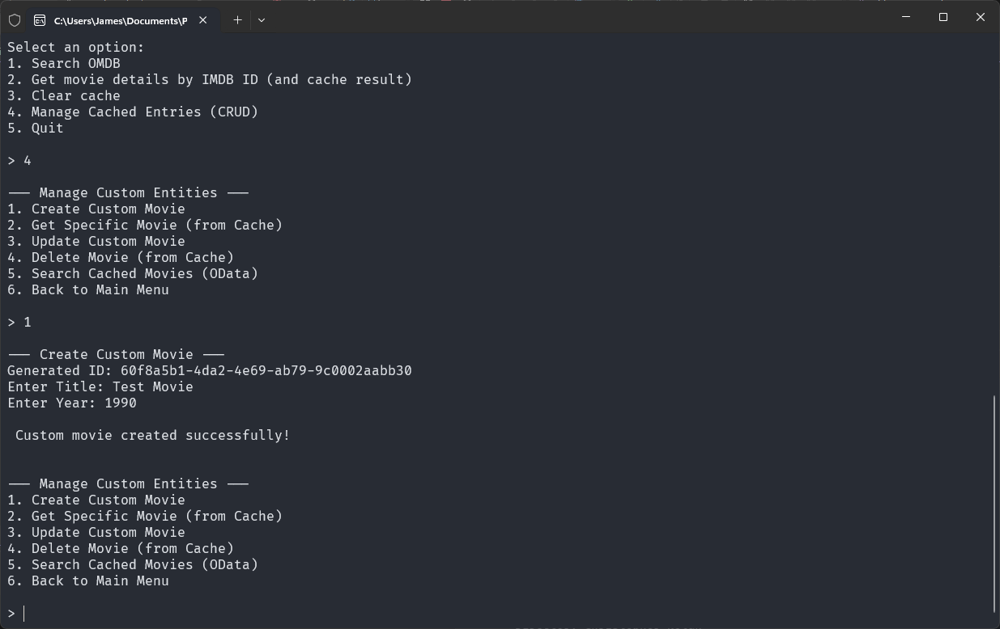
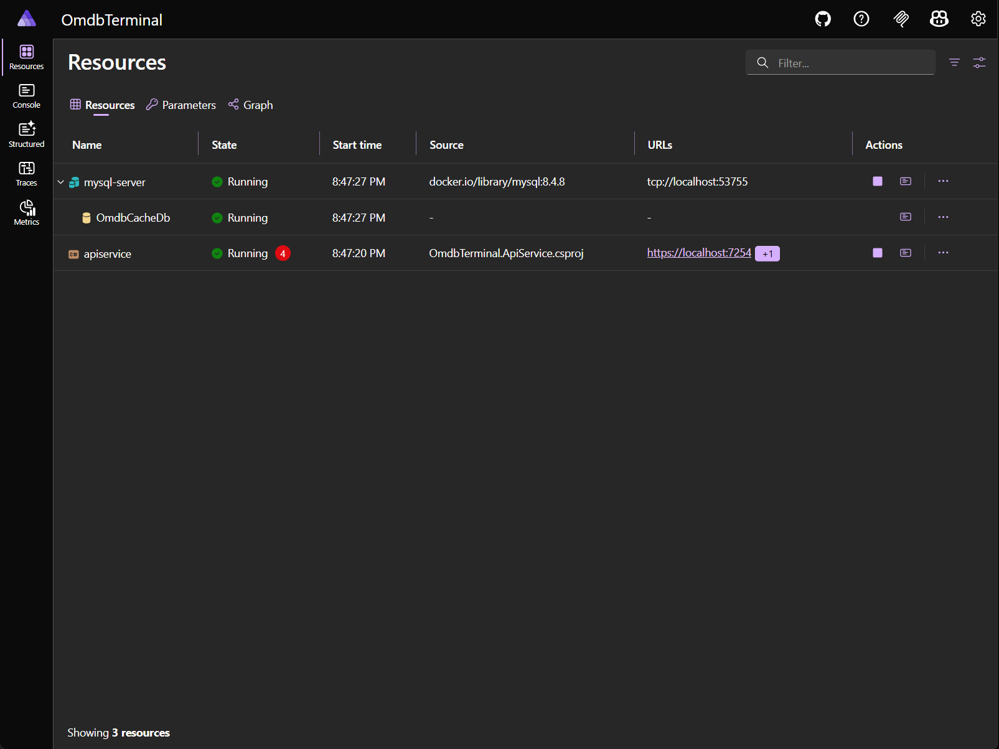

# OMDB Terminal

<div align="center">


</div>

OMDB Terminal is a .NET-based CLI application and REST API designed to interact with the [Open Movie Database (OMDb) API](https://www.omdbapi.com/). Built with a focus on modern .NET architecture (.NET 10), performance, and developer experience. It serves as a proxy for movie data, has intelligent caching and OData search capabilities.

The project is orchestrated using .NET Aspire, which handles containerization, telemetry, and infrastructure management, allowing developers to focus on building features without worrying about setup or configuration.

## Features

### Core Capabilities

- **OMDb API Integration:** Search for movies by title or fetch detailed information using an IMDb ID
- **Intelligent Caching (Cache-Aside Pattern):** Movie details fetched from OMDb are automatically persisted to a local MySQL database. Subsequent requests for the same movie are served from the database - reducing API quota usage and improving response times
- **Advanced Data Searching (OData):** Perform complex, server-side filtering, sorting, and pagination on cached movie data directly via standard OData query strings (e.g., `?$filter=contains(Title, 'Matrix')&$orderby=Year desc`)
- **Complete Cache Management:** Full CRUD (Create, Read, Update, Delete) operations available via a dedicated `CachedEntries` controller

### Architecture & Infrastructure

- **.NET Aspire Orchestration:** The entire solution (API, MySQL Database, and Telemetry) is managed by .NET Aspire, ensuring a one-click local setup with automatic container provisioning and connection string injection
- **Entity Framework Core:** Leverages [EF Core](https://www.nuget.org/packages/microsoft.entityframeworkcore) with [Pomelo MySQL](https://www.nuget.org/packages/Pomelo.EntityFrameworkCore.MySql/) for automated design-time migrations and data operations
- **Service-Oriented Architecture:** Strict separation of concerns, keeping Controllers thin by delegating business logic and database interactions to dedicated services (`IMovieService`, `ICachedEntriesService`)
- **Dependency Injection:** Utilizes a static `SimpleInjector` container within the CLI for dependency resolution

### Developer Experience

- **Swagger Integration:** Full OpenAPI documentation with a custom Swagger filter (`ODataOperationFilter`) to natively support OData parameter inputs within the Swagger UI
- **OpenTelemetry Dashboard:** Real-time visibility into database queries, HTTP requests, and application logs via the .NET Aspire Dashboard

---

## Media & Screenshots

### Terminal CLI Action

*Searching for movies by title*



*Fetching and caching detailed movie data by IMDb ID*



*Manually creating a cached entry via the CLI*



### .NET Aspire Infrastructure

*The .NET Aspire Dashboard showing live telemetry, traces, and connected resources*



*Startup logs demonstrating automatic MySQL container provisioning and EF Core migration execution*


### 🎥 Demo Video
Check out the full end-to-end workflow in action:
<video src="Screenshots/V1/Demo.mp4" muted autoplay loop playsinline style="max-width: 100%;">
</video>

## 🔮 Planned Improvements (V2)

While V1 establishes a rock-solid backend foundation and MVP loop, V2 will focus on significantly enhancing the user interface and expanding the application's intelligence.

- **Graphical Terminal UI:** Transition from a basic `while` loop to a proper GUI using `Terminal.Gui` (gui.cs), featuring interactive lists, input fields, and dialog boxes
- **Expanded Caching Capabilities:** Implement caching for broader search results (e.g., caching the list of movies returned when searching for a keyword), rather than just caching the exact movie details
- **Intuitive OData CLI Integration:** Abstract the OData query string syntax within the CLI, allowing users to build complex filters via menus rather than typing raw `?$filter=contains(Title, 'Star')` query strings manually
- **Improved Logging:** More granular and structured logging via OpenTelemetry for deeper insights into cache hit/miss ratios and pipeline execution
- **Improved Error Handling:** Implement more robust error handling and user feedback in the CLI, especially around API failures, database issues, and invalid inputs

## Getting Started

### Prerequisites
- [.NET 10 SDK](https://dotnet.microsoft.com/download) (or the specific version configured in the project)
- [Docker Desktop](https://www.docker.com/products/docker-desktop/) (required for .NET Aspire to spin up MySQL)
- An OMDb API Key

### Running the Project

1. Clone the repository.
2. Set your OMDb API key in the `OmdbTerminal.ApiService` user secrets or `appsettings.json`.
3. Open a terminal in the `OmdbTerminal.AppHost` directory.
4. Run the orchestrator:
   ```bash
   dotnet run --configuration Release
   ```